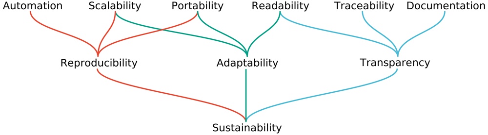
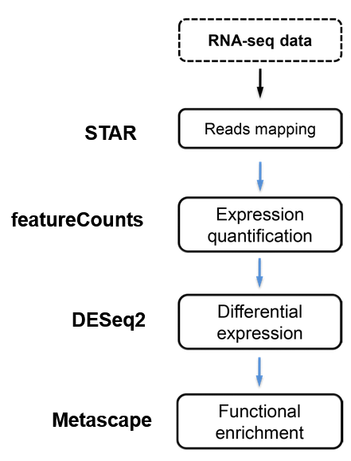
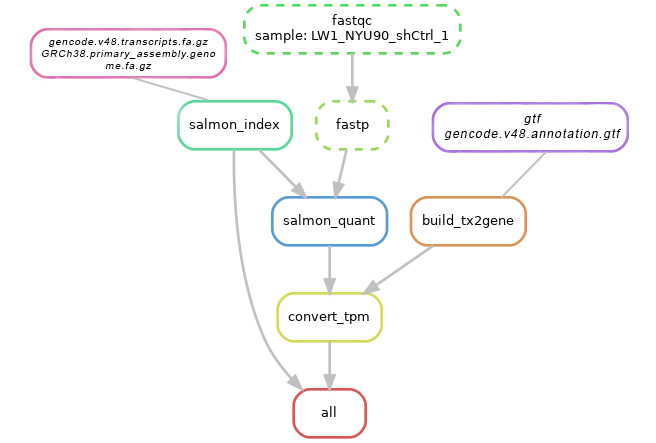
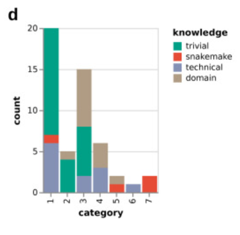

# Snakemake for RNA-seq  
###### BENG 183 – Sustainable Data Analysis with Workflow Managers  

---

1. [Introduction: Why Workflow Automation? Why Snakemake?](#1)  
2. [RNA-seq & Typical Pipelines](#2)  
3. [Snakemake Basics: Rules, DAGs, and Wildcards](#3)  
   3.1. [Rules & `rule all`](#31)  
   3.2. [DAG Construction & Incremental Runs](#32)  
   3.3. [Wildcards](#33)  
   3.4. [Configs, Resources, and Execution Backends](#34)  
4. [Worked Example: RNA-seq Pipeline in Snakemake](#4)  
5. [Limitations, Extensions, and Switching to Snakemake](#5)  
6. [References](#6)  

---

## 1. Introduction: Why Workflow Automation? Why Snakemake?
Workflow automation refers to the use of software systems to coordinate, schedule, and execute computational tasks with 
minimal manual intervention. Rather than sequentially running individual commands and manually tracking file dependencies, 
parameters, and intermediate outputs, an automated workflow framework ensures that each task is executed in the correct 
order and with the appropriate inputs. **Snakemake** has become a widely adopted workflow management system in computational 
biology because of its clear syntax, strong emphasis on reproducibility, and ability to scale from single-machine analyses 
to large high-performance computing environments. By formally defining dependencies and execution logic, Snakemake addresses 
many limitations inherent to traditional ad hoc bash pipelines—such as fragility, lack of provenance tracking, and 
difficulty scaling—while providing a robust and transparent foundation for sustainable data analysis.

#### **Snakemake is designed to be sustainable, surive interruptions, and evolve with new data and processes**
- **Automation**: Snakemake automatically figures out which steps to run, in which order, based on declared inputs/outputs
and the target files you ask for, instead of manually chaining commands.  
- **Scalability**: The same Snakefile can scale from a few samples on a laptop to hundreds on an HPC cluster by
parallelizing independent rules and adjusting only the execution profile, not the workflow logic.  
- **Portability**: Per-rule Conda or container definitions let Snakemake pin software and versions, so the exact same
workflow can run reliably across different machines, OSes, and compute environments.  
- **Readability**: Snakemake uses a Pythonic, rule-based syntax where each step is a small, named block (rule) with explicit
input, output, and commands, making complex pipelines easier to understand and review.  
- **Traceability**: Because every file is produced by a specific rule and command, Snakemake can show exactly how each
output was generated (DAG, rulegraph, logs), enabling you to trace results back through all intermediate steps.  
- **Documentation**: The combination of clear rule names, config files, environment specs, and built-in reporting (e.g. `--
report`) means the workflow itself serves as executable documentation of the entire analysis.  

## 2. RNA-seq & Typical Pipelines

## 3. Snakemake Basics: Rules, DAGs, and Wildcards 

Snakemake workflows are built around a simple but powerful idea: instead of explicitly writing out the order of operations, 
you describe *how files are created from other files*, and Snakemake automatically infers the correct execution order. This 
is achieved through rules, wildcards, and the construction of a Directed Acyclic Graph (DAG) that defines all necessary 
steps. Together, these components make Snakemake flexible, scalable, and intuitive, even for users with limited programming 
experience.

### 3.1 Rules & `rule all` 

In Snakemake, **rules** define transformations from input files to output files, rather than dictating explicit step-by-step 
execution. Each rule includes fields such as `input`, `output`, `params`, `threads`, `resources`, and a `shell` or `run` 
block that performs the actual operation. Most workflows also include a top-level **`rule all`** that declares the desired 
final outputs of the pipeline. Snakemake uses these targets as the endpoint, working backward to determine which 
intermediate files and rules must be executed. This makes workflows clean, declarative, and highly modular.

### 3.2 DAG Construction & Incremental Runs 

Snakemake uses the relationships between rule inputs and outputs to construct a **Directed Acyclic Graph (DAG)**, where 
each 
job is a node and edges represent dependencies. The DAG dictates execution order, enabling Snakemake to run independent 
jobs 
in parallel and skip any steps whose outputs are already up to date. Tools such as `--dag`, `--rulegraph`, and `--dry-run` 
make it easy to visualize or validate the workflow before executing it. For cases where output filenames or counts aren’t 
known until runtime, Snakemake offers **checkpoints**, which pause DAG creation, inspect dynamic outputs, and then expand 
the graph accordingly.

### 3.3 Wildcards 

**Wildcards**—such as `{sample}` or `{chr}`—allow a single rule to operate on multiple files without duplication. Snakemake 
automatically infers wildcard values based on matching file patterns. For example, if the rule expects an input 
`mapped_reads/{sample}.bam` and you have a file `mapped_reads/B.bam`, Snakemake assigns `{sample} = B`. Wildcards also work 
inside shell commands using `{wildcards.sample}`, enabling highly scalable pipelines that adapt seamlessly as sample lists 
grow. Together with `expand()`, wildcards make batch processing straightforward and maintainable.

### 3.4 Configs, Resources, and Execution Backends 

Workflows often use a `config.yaml` file to store paths, sample tables, and parameters, making Snakemake portable and easy 
to reuse across different datasets. Rules can specify resource needs such as threads, memory, and GPUs, and Snakemake 
schedules jobs efficiently to optimize compute usage. It supports a wide range of execution backends—from local execution 
to HPC schedulers (SLURM, SGE, LSF), Kubernetes, Tibanna, and major cloud platforms—without modifying the workflow itself. 
Reproducibility is strengthened further through per-rule Conda environments and container support, while utilities like 
`protected()` and `temp()` handle file safety and cleanup. Debugging is facilitated through tools like `--dry-run`, `--
dag`, `--rulegraph`, and HTML reports generated via `--report`.

Together, these components form the foundation of Snakemake’s workflow model, enabling clean, scalable, and highly 
reproducible analyses across diverse computational environments.

## 4. Worked Example: RNA-seq Pipeline in Snakemake

## 5. Limitations, Extensions, and Switching to Snakemake
Even though Snakemake is powerful, it does come with certain limitations. Checkpoints—while extremely useful for handling 
dynamic or unknown inputs—can be tricky to implement correctly. They require careful planning, and if the logic that 
determines downstream files is even slightly off, Snakemake may produce a malformed DAG or fail with confusing errors. 
Another fundamental limitation is that Snakemake workflows must be **acyclic**, meaning you cannot express iterative or 
recursive algorithms directly in the workflow graph. Any looped or cyclical process must be handled inside a script rather 
than through Snakemake’s rule structure. Snakemake can also become harder to read and manage when pipelines reach thousands 
of tasks or very deep branching structures, since file-driven workflows naturally grow in complexity as datasets scale.

Despite these limitations, Snakemake benefits from a very active community. There are extensive collections of ready-made 
wrappers (each bundling tools with pinned versions), prebuilt modules, and complete workflows that cover common analyses 
like RNA-seq, ChIP-seq, ATAC-seq, variant calling, metagenomics, and more. Many of these are maintained directly by the 
Snakemake team or by broader bioinformatics groups, which makes it much easier for new users to adopt best practices 
without reinventing the pipeline from scratch. It’s also worth highlighting alternatives such as **Nextflow**, **CWL**, and 
**WDL/Cromwell**, which are widely used in other research communities and large consortia. These workflow engines share 
many goals—reproducibility, portability, sustainability—but differ in syntax, execution models, and strengths (e.g., 
Nextflow’s tight container integration and cloud support). In practice, Snakemake remains one of the most accessible and 
beginner-friendly workflow systems, especially in academic bioinformatics, while still offering enough flexibility and 
reproducibility features for large-scale and long-term projects.

However, we ultimately selected **Snakemake** because of its accessibility and smooth learning curve. Analyses of workflow 
complexity show that the majority of lines in a typical Snakefile fall into **complexity level 1**—simple rule declarations 
or keyword–colon structures—while only a small fraction reach **complexity level 7**, which corresponds to full Python 
expressions. In practice, this means that users can build functional, well-structured workflows without needing extensive 
programming experience, and only incorporate more advanced Python logic as their projects grow. This balance of simplicity 
and extensibility makes Snakemake particularly well-suited for teaching, onboarding new lab members, and maintaining long-
term sustainable workflows.

## 6. References
[1] Mölder, F., Jablonski, K. P., Letcher, B., Hall, M. B., Tomkins-Tinch, C. H., Sochat, V., *et al.* (2021). 
**Sustainable data analysis with Snakemake**. *F1000Research*, 10:33.  
    https://pmc.ncbi.nlm.nih.gov/articles/PMC8114187/

[2] **Snakemake Documentation**.  
    https://snakemake.readthedocs.io/en/stable/
